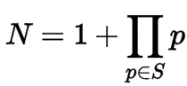
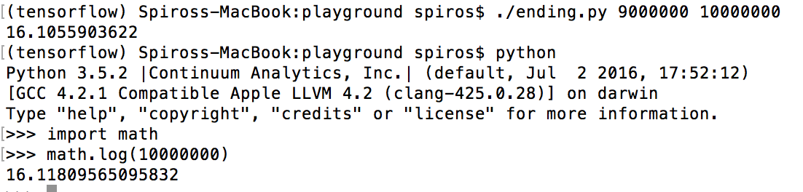

### 1. [Sieve](sieve.py) of eratosthenes (python) (sieve.py)

An ancient,simple and quicker way than the brute force approach of finding all prime numbers up to a given limit.

* Create a list of consecutive integers from 2 through n: (2, 3, 4, ..., n).
* Initially, let p equal 2, the smallest prime number.
* Enumerate the multiples of p by counting to n from 2p in increments of p, and mark them in the list (these will be 2p, 3p, 4p, ...; the p itself should not be marked).
* Find the first number greater than p in the list that is not marked. If there was no such number, stop. Otherwise, let p now equal this new number (which is the next prime), and repeat from step 3.
* When the algorithm terminates, the numbers remaining not marked in the list are all the primes below n. (From Wikipedia)

### 2. nth Euclid Number (euclidn.py)

It is often erroneously reported that Euclid in his proof that primes are infinite begins with the assumption that the set initially considered contains all prime numbers, leading to a contradiction, or that it contains precisely the n smallest primes rather than any arbitrary finite set of primes. Today, the product of the smallest n primes plus 1 is conventionally called the nth Euclid number.(From Wikipedia)

### 3. List of primes in range, using Sieve. (sieveb.py)

Note that all primes up to the largest number will be computed.

### 4. Distribution of primes (gap.py)

For large enough N, the probability that a random integer not greater than N is prime is very close to 1 / log(N). [Prime Number theorem](https://en.wikipedia.org/wiki/Prime_number_theorem)

*In the image below I ran the app to calculate the average space between primes in the range `9.000.000` and `10.000.000`. You can see that it is 16.1 which is also what the natural logarithm of `10.000.000` is. This confirms the prime number theorem which states that the probability a number `(N)` is prime is `1/log(N)`*

### 5. Faster implementation of Eratosthene's sieve (siever.py)
A faster implementation from https://stackoverflow.com/a/3035188/557418